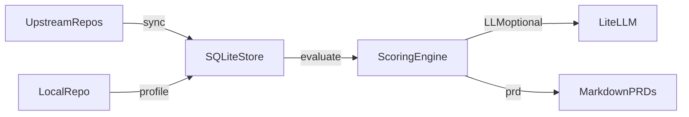

# Parascope

<p align="center">
  
</p>

<h2 align="center">PR Intelligence for Codebases</h2>

<p align="center">
  <b>STAY ALIGNED. SHIP FASTER.</b>
  <br />
  <i>Track upstream PRs, evaluate relevance, and generate implementation PRDs.</i>
</p>

<p align="center">
  <a href="LICENSE"></a>
  
  
  
</p>

---

**Parascope** is a local-first CLI that monitors upstream GitHub PRs, scores them against your codebase, and generates implementable PRDs. It is built for engineering teams who want to stay aligned with upstream changes without drowning in noise.

> *"Keep upstream changes visible, relevant, and actionable."*

---

## What Parascope Is

- A **multi-stage PR analyzer** with rule-based, semantic, and AI-powered scoring
- A **local codebase profiler** that understands your project structure
- A **merged-PR tracker** with deduplication by repo and codebase state
- A **semantic duplicate detector** that finds already-implemented patterns
- A **high-signal PRD generator** that only outputs actionable, non-duplicate recommendations

## What Parascope Is Not

- A GitHub bot (no webhooks or server required)
- A CI/CD system or alerting pipeline
- A source of noise (LLM mode filters aggressively for genuine relevance)
- A replacement for reviewing upstream code changes yourself

---

## Core Pillars

| Pillar | Description |
|--------|-------------|
| **PR Discovery** | Monitor merged PRs from upstream repos by default |
| **Codebase Profiling** | Scan local repo structure and dependencies |
| **Multi-Stage Scoring** | Rule-based + semantic + LLM analysis |
| **Duplicate Detection** | Semantic search to find already-implemented patterns |
| **High-Signal PRDs** | Only generate for high-confidence, non-duplicate recommendations |

---

## Evaluation Pipeline

Parascope uses a **3-stage pipeline** to ensure PRDs are 100% relevant:

```
Stage 1: Rule-Based Filtering
├── Keyword matching (PR title/body vs feature keywords)
├── Path matching (PR files vs feature globs)
└── Score threshold filter (skip low-relevance PRs)
        │
        ▼
Stage 2: Semantic Similarity
├── Embed PR description + local code
├── Find similar implementations in your codebase
└── Flag potential duplicates (similarity > 85%)
        │
        ▼
Stage 3: LLM Analysis
├── Full context: PR + local code snippets + similarity results
├── Decision: implement / partial / skip
├── Confidence score (0-100%)
└── Reasoning: why this matters (or doesn't)
        │
        ▼
PRD Generation (only for high-confidence "implement" decisions)
```

### Why 3 Stages?

| Stage | Purpose | Without It |
|-------|---------|------------|
| Rule-based | Fast filtering, reduce API calls | Too many LLM requests |
| Semantic | Detect duplicates, find local context | PRDs for already-implemented features |
| LLM | Final judgment with reasoning | No understanding of "should we do this?" |

**Recommendation:** Enable LLM (`llm.enabled: true`) for production use. Rule-based mode produces noise.

---

## Handling Large Repositories

When monitoring repos with 1000s of PRs, Parascope uses **incremental sync** and **batch evaluation**:

### How It Works

```
First sync:
  └── Fetches PRs from last 90 days (configurable via `since`)
  └── Stores watermark timestamp

Subsequent syncs:
  └── Only fetches PRs newer than watermark
  └── Skips unchanged PRs (same head_sha)

Evaluation:
  └── Batch limit (default: 25 PRs)
  └── Run multiple times to process more
  └── Already-evaluated PRs are skipped
```

### Configuration

```yaml
sync:
  since: 90d          # Initial window: 90d, 6m, 1y, or "2024-01-01"
  incremental: true   # Use watermark for subsequent syncs
  max_prs: 100        # Per-repo limit
  eval_batch_size: 25 # LLM calls per evaluate run
```

### CLI Examples

```bash
# First time: fetch last 90 days
parascope sync

# Later: only new PRs (incremental)
parascope sync

# Override: fetch last 30 days, ignore watermark
parascope sync --since 30d --full

# Evaluate in batches (control LLM costs)
parascope evaluate --batch 10

# Continue evaluating remaining
parascope evaluate
```

---

## Language Support

Parascope is **language-agnostic**. It works with any codebase.

### Supported Languages

| Language | Dependency Parsing | File Detection |
|----------|-------------------|----------------|
| TypeScript/JavaScript | `package.json` | `.ts`, `.tsx`, `.js`, `.jsx` |
| Python | `pyproject.toml`, `requirements.txt` | `.py` |
| Go | (planned: `go.mod`) | `.go` |
| Rust | (planned: `Cargo.toml`) | `.rs` |
| Java/Kotlin | (planned: `pom.xml`, `build.gradle`) | `.java`, `.kt` |
| Any other | File tree only | By extension |

### How It Works

1. **File Tree Scanning** - Works for all languages
2. **Dependency Parsing** - Extracts from package managers
3. **Path Matching** - Glob patterns work universally
4. **LLM Analysis** - Understands any programming language

### Example: TypeScript Project

```yaml
# parascope.features.yml
features:
  components:
    keywords: [component, react, svelte, vue]
    paths:
      - "**/components/**"
      - "**/*.tsx"
      - "**/*.svelte"
  
  api:
    keywords: [api, endpoint, route, handler]
    paths:
      - "**/routes/**"
      - "**/api/**"
      - "**/*.controller.ts"
```

The profiler automatically detects:
- `package.json` dependencies
- File extensions (`.ts`, `.tsx`, `.js`, `.jsx`, `.svelte`, etc.)
- Project structure

---

## Installation

```bash
# Clone and install (editable)
git clone https://github.com/your-org/parascope.git
cd parascope
pip install -e .

# Or install directly
pip install parascope
```

---

## Architecture

```
┌─────────────────────────────────────────────────────────┐
│                   parascope CLI                          │
│  ┌──────────┐  ┌──────────┐  ┌──────────┐  ┌─────────┐  │
│  │  init    │  │ profile  │  │   sync   │  │evaluate │  │
│  └──────────┘  └──────────┘  └──────────┘  └─────────┘  │
│  ┌──────────┐  ┌──────────┐  ┌──────────┐               │
│  │   prd    │  │  digest  │  │ history  │               │
│  └──────────┘  └──────────┘  └──────────┘               │
└───────────────────────┬─────────────────────────────────┘
                        │
    ┌───────────────────┼───────────────────┐
    ▼                   ▼                   ▼
┌────────┐      ┌─────────────┐      ┌───────────┐
│ GitHub │      │   SQLite    │      │  LiteLLM  │
│  REST  │      │   Store     │      │ (Optional)│
└────────┘      └─────────────┘      └───────────┘
```

### Data Flow



---

## Quickstart

```bash
# 1) Initialize in your repository
cd /path/to/your/repo
parascope init

# 2) Configure upstream repos (edit parascope.yml)
# 3) Define features to match (edit parascope.features.yml)

# 4) Set up environment variables
cp env.example .env
# Edit .env with your API keys (at minimum, GITHUB_TOKEN)

# 5) Profile your codebase
parascope profile

# 6) Sync PRs from upstream
parascope sync

# 7) Evaluate relevance
parascope evaluate

# 8) Generate PRDs for relevant PRs
parascope prd

# 9) View digest of relevant PRs
parascope digest
```

---

## Workflow

1. **Initialize**: `parascope init` creates configs and the local SQLite store
2. **Profile**: `parascope profile` scans the local repo (`local_repo` in config)
3. **Sync**: `parascope sync` fetches upstream PRs (merged by default)
4. **Evaluate**: `parascope evaluate` scores PRs vs features and rules
5. **Generate**: `parascope prd` produces implementation PRDs

---

## CLI Reference

| Command | Purpose | Example |
|---------|---------|---------|
| `init` | Create config, db, and templates | `parascope init --force` |
| `profile` | Scan local codebase | `parascope profile --json` |
| `sync` | Fetch upstream PRs | `parascope sync --since 30d` |
| `evaluate` | Score PR relevance | `parascope evaluate --batch 10` |
| `prd` | Generate PRD documents | `parascope prd --pr 123` |
| `digest` | Summarize relevant PRs | `parascope digest --limit 20` |
| `history` | View evaluation history | `parascope history --decision relevant` |

### Sync Options

```bash
parascope sync                     # Incremental (new PRs since last sync)
parascope sync --since 30d         # Last 30 days
parascope sync --since 2024-01-01  # Since specific date  
parascope sync --since 6m          # Last 6 months
parascope sync --full              # Ignore watermark, use --since window
parascope sync --max-prs 50        # Limit PRs per repo
```

### Evaluate Options

```bash
parascope evaluate                 # Evaluate unevaluated PRs
parascope evaluate --batch 10      # Limit to 10 PRs (control LLM costs)
parascope evaluate --pr 123        # Evaluate specific PR
parascope evaluate --force         # Re-evaluate all
```

---

## Configuration

### `parascope.yml`

```yaml
# Local repository to profile and compare against upstream PRs
local_repo: .  # Current directory (default)
# local_repo: ~/workspace/my-project
# local_repo: /absolute/path/to/repo

# Project context (optional - README is used automatically)
# Only needed if your README doesn't describe your project well
# project:
#   name: My Project
#   description: |
#     Override description for LLM context.

# Upstream repositories to monitor
upstream:
  - repo: openclaw/openclaw
    filters:
      # Per-repo overrides (optional)
      # state: merged
      # labels: [security, agents]

# Sync settings (handles repos with 1000s of PRs)
sync:
  state: merged       # merged (default), open, closed, all
  max_prs: 100        # Maximum PRs to fetch per repo
  fetch_files: true   # Fetch file changes (needed for path matching)
  since: 90d          # Date window: 90d, 6m, 1y, or ISO date
  incremental: true   # Only fetch new PRs after initial sync
  eval_batch_size: 25 # Max PRs to evaluate per run (controls LLM costs)

# Scoring thresholds
scoring:
  min_rule_score: 0.3    # Minimum score to consider
  min_final_score: 0.5   # Threshold for "relevant"
  keyword_weight: 0.4    # Weight for keyword matching
  path_weight: 0.6       # Weight for path matching

# LLM configuration (RECOMMENDED for high-quality, noise-free results)
# Without LLM, you get rule-based matching only (more noise)
# API keys are read from environment variables
llm:
  enabled: true          # Enable for production use
  model: gpt-4o          # LiteLLM model string
  # model: claude-3-opus # Anthropic
  # model: gemini-pro    # Google
  # model: ollama/llama2 # Local Ollama
  temperature: 0.2       # Lower = more consistent decisions
  max_tokens: 3000
```

### `parascope.features.yml`

```yaml
features:
  security:
    keywords:
      - security
      - auth
      - jwt
      - tls
      - injection
    paths:
      - "**/security/**"
      - "**/auth/**"
      - "**/*auth*.py"

  streaming:
    keywords:
      - stream
      - sse
      - websocket
      - chunk
    paths:
      - "**/streaming*"
      - "**/stream*"

  api:
    keywords:
      - api
      - endpoint
      - route
    paths:
      - "**/api/**"
      - "**/routes/**"
```

### Environment Variables

Parascope loads environment variables from a `.env` file in your repo root.

```bash
cp env.example .env
```

| Variable | Required | Description |
|----------|----------|-------------|
| `GITHUB_TOKEN` | Yes | GitHub personal access token for syncing PRs |
| `OPENAI_API_KEY` | If using OpenAI | For gpt-4o, gpt-4-turbo, o1, etc. |
| `ANTHROPIC_API_KEY` | If using Anthropic | For claude-3-opus, claude-3-sonnet, etc. |
| `GOOGLE_API_KEY` | If using Google | For gemini-pro, gemini-1.5-pro, etc. |

See `env.example` or [LiteLLM docs](https://docs.litellm.ai/docs/providers) for all supported providers.

---

## Scoring Algorithm

### Stage 1: Rule-Based Score

1. **Keyword Matching** (40% weight)
   - Checks PR title and body against feature keywords
   - Score = matched keywords / total keywords

2. **Path Matching** (60% weight)
   - Matches PR file paths against feature glob patterns
   - Score = matched files / total files

PRs below `min_rule_score` (0.3) are skipped.

### Stage 2: Semantic Similarity

- Uses embeddings to compare PR description vs local code
- Flags PRs with >85% similarity as "potentially implemented"
- Provides local code snippets to LLM for comparison

### Automatic Project Context

Parascope automatically reads your project's **README.md** and includes it in the LLM prompt. This helps the LLM understand:
- What your project does
- What technologies it uses
- What's relevant vs. irrelevant

No manual configuration needed - just have a README in your repo.

**Optional override:** If your README isn't descriptive enough, add a custom description:

```yaml
# parascope.yml
project:
  name: My Project
  description: |
    Custom description for LLM context.
    RELEVANT: feature X, technology Y
    NOT RELEVANT: unrelated topics
```

### Stage 3: LLM Decision

The LLM receives full context (including your README) and returns:

| Field | Description |
|-------|-------------|
| `decision` | `implement`, `partial`, or `skip` |
| `confidence` | 0.0 - 1.0 (70%+ required for PRD) |
| `already_implemented` | true/false |
| `reasoning` | Why this decision was made |

**Final Decision:**
- `relevant`: LLM says "implement" with >= 70% confidence
- `maybe`: LLM says "partial" with >= 60% confidence
- `skip`: Everything else

---

## Deduplication

Evaluations are keyed by:

- PR ID
- Local profile SHA (your codebase state)
- PR head SHA (PR state)

If both your codebase and the PR have not changed, evaluation is skipped.

---

## Database Schema

SQLite database stored in `.parascope/parascope.db`:

```sql
-- Local codebase profiles
repo_profiles(repo_root, profile_sha, profile_json, created_at)

-- Tracked upstream repos
upstream_repos(full_name, last_synced_at, last_seen_updated_at)

-- PR metadata
pull_requests(repo_id, number, state, title, body, author, ...)

-- Files changed per PR
pr_files(pr_id, path, additions, deletions)

-- Evaluation results (deduped)
evaluations(pr_id, local_profile_sha, pr_head_sha, rule_score, ...)

-- Generated artifacts
artifacts(evaluation_id, type, path, created_at)
```

---

## Supported LLM Providers

Parascope uses [LiteLLM](https://docs.litellm.ai/) for unified LLM access.

| Provider | Model Examples | API Key Env Var |
|----------|---------------|-----------------|
| OpenAI | `gpt-4o`, `gpt-4-turbo`, `o1` | `OPENAI_API_KEY` |
| Anthropic | `claude-3-opus`, `claude-3-sonnet` | `ANTHROPIC_API_KEY` |
| Google | `gemini-pro`, `gemini-1.5-pro` | `GOOGLE_API_KEY` |
| Azure | `azure/gpt-4` | `AZURE_API_KEY` |
| Ollama | `ollama/llama2`, `ollama/mistral` | (none - local) |
| AWS Bedrock | `bedrock/claude-v2` | AWS credentials |

---

## Project Structure

```
parascope/
├── cli.py          # Click CLI with 7 commands
├── config.py       # YAML config loader
├── store.py        # SQLite storage layer
├── profile.py      # Codebase profiler
├── github.py       # GitHub REST API client
├── scoring.py      # Multi-stage scoring engine
├── semantic.py     # Embedding-based similarity search
├── llm.py          # LiteLLM integration for AI analysis
├── prd.py          # PRD generator
└── templates/      # Jinja2 templates

tests/
├── test_config.py  # Config parsing tests
├── test_github.py  # Merged PR filter tests
├── test_scoring.py # Scoring algorithm tests
├── test_store.py   # Deduplication tests
└── test_semantic.py # Semantic search tests
```

---

## Development

```bash
# Install with dev dependencies
make dev

# Run tests
make test

# Lint + format check + tests
make check

# Format code
make format

# Clean build artifacts
make clean
```

Or manually:

```bash
pip install -e ".[dev]"
pytest -v
ruff check .
ruff format .
```

### Makefile Targets

| Target | Description |
|--------|-------------|
| `make install` | Install package (editable) |
| `make dev` | Install with dev dependencies |
| `make test` | Run unit tests |
| `make lint` | Run linter (ruff) |
| `make format` | Format code |
| `make check` | Lint + format check + tests |
| `make clean` | Remove build artifacts |
| `make run` | Full workflow: profile -> sync -> evaluate -> prd |

---

## License

MIT
